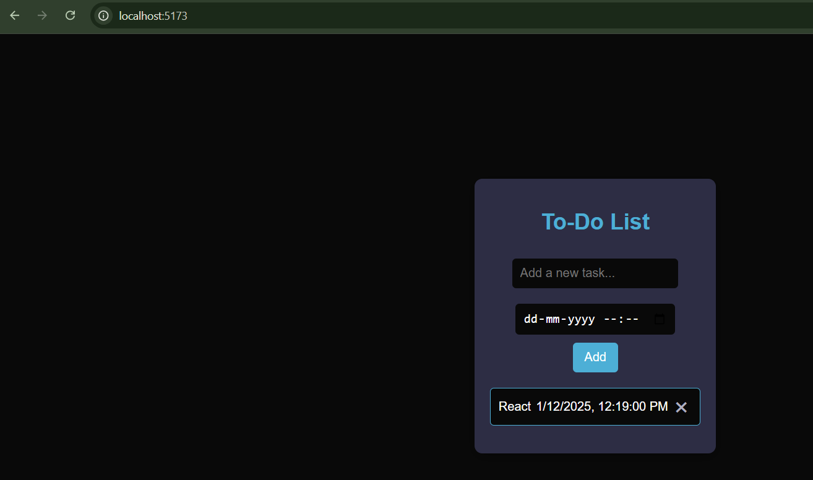

# Project Name: To-Do List
## Description:
A simple and interactive To-Do List application built with React. This app allows users to:

Add tasks with a description and a scheduled time.
View all added tasks in a list.
Delete tasks when they are no longer needed.

## Technologies Used:
React (JavaScript library for building the UI)
CSS (for styling)

